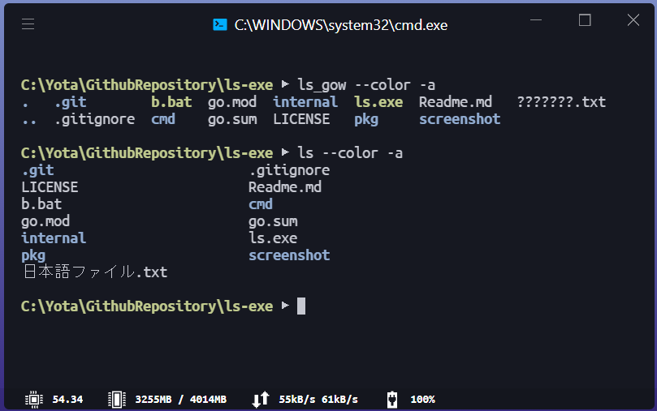
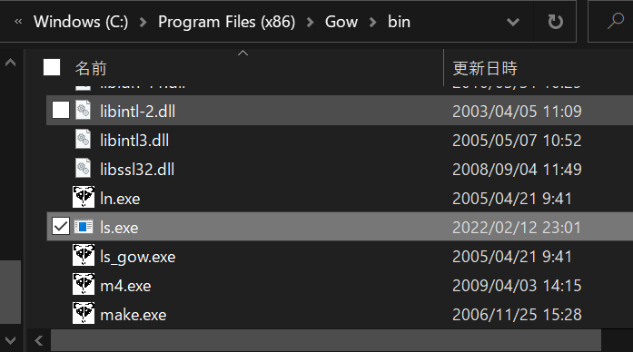

# ls command for windows written in Go

# Caution
__There are many differences of behavior from official ls command.
It only provides directory listing function.__

## Features
- Windows support
- Minimum functions
- 日本語に対応 (multibyte-char support)

## Install
```shell
$ go install github.com/atoy322/ls-exe/cmd/ls@latest
```

## Supported arguments
- `-a`  show hidden file (filename[0] == '.')
- `--color`  colored output
- I'll add args someday.

## Why did I make this
Because the Gow(GNU on Windows) does not support for Japanese(multibyte-char).

## screenshot



## License
MIT
